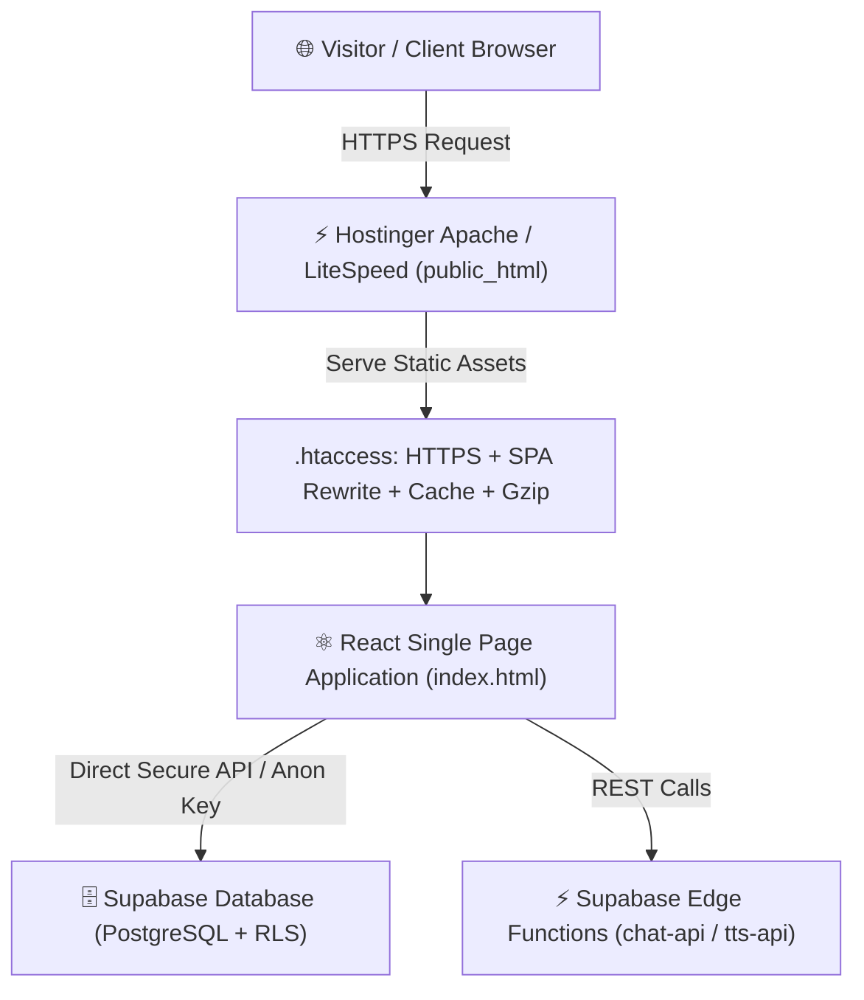

# 🚀 Hostinger Production Deployment Guide
### ZippyTech Systems Portfolio Website (Vite + React + Supabase)

> **MIGRATION STATUS:** All legacy deployment configurations (Vercel, Railway, Netlify) have been removed. 
> The project is 100% prepared, audited, and optimized for **Hostinger Web Hosting (Apache / LiteSpeed)**.

---

## 🇮🇳 Telugu Quick Summary (శీఘ్ర వివరణ)

1. **ప్రాజెక్ట్ డిప్లాయ్‌మెంట్ విధానం (Architecture)**:
   - మీ పోర్ట్‌ఫోలియో ఫ్రంటెండ్ (React + Vite) హోస్టింగర్ **`public_html/`** లో static files గా హోస్ట్ అవుతుంది.
   - డేటాబేస్, లీడ్స్ మేనేజ్మెంట్, AI చాట్‌బాట్, మరియు TTS వాయిస్ ఏజెంట్ అన్నీ **Supabase** (Postgres DB + Edge Functions) లో సురక్షితంగా రన్ అవుతాయి.
   - Vercel, Railway, Netlify ఫైల్స్ తొలగించబడ్డాయి. హోస్టింగర్ కోసం `.htaccess` మాత్రమే ఉపయోగించబడుతుంది.

2. **3 ముఖ్యమైన నియమాలు (Critical Steps)**:
   - **`dist/` లేదా `hostinger_frontend_dist.zip`** లోని ఫైల్స్‌ను నేరుగా Hostinger File Manager లో **`public_html/`** ఫోల్డర్‌లో upload & extract చేయాలి.
   - `.htaccess` ఫైల్ తప్పకుండా `public_html/` రూట్ డైరెక్టరీలో ఉండాలి (ఇది పేజీ రిఫ్రెష్ చేసినప్పుడు 404 రాకుండా SPA రూటింగ్‌ను, HTTPS ను కంట్రోల్ చేస్తుంది).
   - Hostinger hPanel లో ఉచిత **Let's Encrypt SSL** యాక్టివేట్ చేయండి.

---

## 🏗️ Deployment Architecture



---

## 📋 Step-by-Step Deployment Instructions

### Step 1: Verify Environment Variables (`.env`)
In Vite, `VITE_*` environment variables are compiled directly into the client bundle at build time. Ensure your `.env` in the project root contains:

```env
VITE_SUPABASE_URL=https://cdrwrbmabcyhxngvyrxh.supabase.co
VITE_SUPABASE_ANON_KEY=sb_publishable_G1oB1splS3Wb92LbNZ90pA_NAxOUXpC
```

*(Note: Never expose the Supabase `service_role` key in frontend code or `.env` files).*

---

### Step 2: Build the Production Bundle
Run the production build command in your terminal:
```bash
npm run build
```
This builds all components, minifies JavaScript and CSS, compresses SVG illustrations, and copies `public/.htaccess` directly into `dist/.htaccess`.

---

### Step 3: Create / Verify the Deployment Zip
To upload everything in one simple step, a deployment zip is provided:
```bash
# In PowerShell:
Compress-Archive -Path dist\* -DestinationPath hostinger_frontend_dist.zip -Force
```
The resulting `hostinger_frontend_dist.zip` contains all production assets ready for Hostinger.

---

### Step 4: Upload to Hostinger File Manager
1. Log in to your **Hostinger hPanel** (`https://hpanel.hostinger.com`).
2. Go to **Websites** and click **Manage** next to your domain (`zippytechsystems.com`).
3. Under the **Files** section, click **File Manager** (or access via FTP using FileZilla).
4. Double-click to open the **`public_html/`** folder.
5. If there are default files (such as `default.php`), delete or back them up.
6. Click the **Upload** icon at the top right, choose **File**, and select `hostinger_frontend_dist.zip`.
7. Right-click `hostinger_frontend_dist.zip` inside `public_html/` and click **Extract**.
8. Ensure the extracted files are directly in `public_html/`, looking like this:
   ```text
   public_html/
   ├── .htaccess
   ├── index.html
   ├── robots.txt
   ├── sitemap.xml
   ├── assets/
   │   ├── index-*.js
   │   ├── index-*.css
   │   └── ...
   └── projects/
       ├── saree-app.svg
       └── ...
   ```
9. You can now delete `hostinger_frontend_dist.zip` from `public_html/` to keep your storage clean.

---

### Step 5: How `.htaccess` Protects and Optimizes Your Site
Hostinger uses Apache / LiteSpeed web servers. The bundled `.htaccess` file provides enterprise-grade performance:

1. **HTTPS Enforcement**: Automatically redirects non-secure `http://` visitors to `https://`.
2. **React Router SPA Fallback**:
   ```apache
   RewriteEngine On
   RewriteBase /
   RewriteRule ^index\.html$ - [L]
   RewriteCond %{REQUEST_FILENAME} !-f
   RewriteCond %{REQUEST_FILENAME} !-d
   RewriteCond %{REQUEST_FILENAME} !-l
   RewriteRule . /index.html [L]
   ```
   *Why this matters*: Without this rule, refreshing `/admin`, `/services`, or `/privacy` would cause a **404 Not Found** error on Hostinger. With this rule, Apache gracefully serves `index.html`, and React Router displays the correct page instantly.
3. **Gzip / Deflate Compression**: Drastically reduces download size for HTML, JS, CSS, and SVG assets.
4. **Browser Cache Optimization**:
   - `assets/*.js`, `assets/*.css`, images: Cached for 1 year (`max-age=31536000, immutable`).
   - `index.html`: Set to `no-cache, must-revalidate` so that whenever you deploy a new update, users see it immediately without needing to hard refresh.
5. **Security Headers**: Includes `X-Content-Type-Options: nosniff`, `X-Frame-Options: SAMEORIGIN`, and `Referrer-Policy: strict-origin-when-cross-origin`.

---

### Step 6: Enable Free SSL on Hostinger
1. In Hostinger hPanel, search for **SSL** or go to **Security** > **SSL**.
2. Click **Install SSL** on your domain.
3. Select the free lifetime **Let's Encrypt** SSL certificate.
4. Enable the toggle for **Force HTTPS**.

---

### Step 7: Supabase CORS Configuration for Your Hostinger Domain
To allow your Hostinger domain to communicate securely with Supabase Edge Functions (`chat-api`, `tts-api`, `notify-enquiry`):

Run using the Supabase CLI:
```bash
supabase secrets set ALLOWED_ORIGINS="https://yourdomain.com,https://www.yourdomain.com,http://localhost:5173"
```
*(Replace `yourdomain.com` with your exact live Hostinger domain).*

---

## ✅ Deployment Verification Checklist

After deploying to Hostinger, verify the following points:

- [ ] **Home Page Loads**: Visit `https://yourdomain.com` and ensure the hero section, services, and dynamic INR prices appear.
- [ ] **Direct Route Navigation**: Visit `https://yourdomain.com/admin` or `https://yourdomain.com/services` directly in the URL bar — ensure it loads without 404.
- [ ] **Page Refresh Test**: On any subpage (e.g., `/admin`), press `Ctrl + F5` (hard refresh) and confirm the page reloads cleanly.
- [ ] **SSL Lock Icon**: Ensure the padlock icon appears in the browser address bar.
- [ ] **Enquiry Form / WhatsApp**: Submit a test enquiry on the contact section and verify it stores in Supabase and routes to WhatsApp.
- [ ] **Chatbot & Voice Agent**: Click the AI Chatbot button (bottom-left) and Voice Agent to confirm responsive answers.
