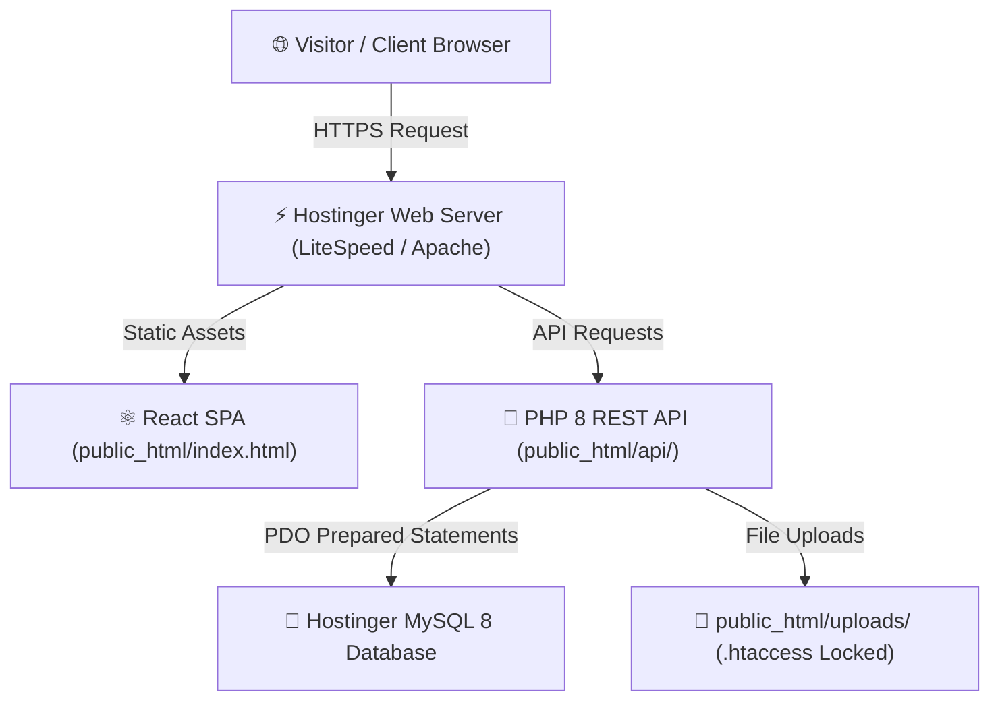

# 🚀 Hostinger Production Deployment Guide
### ZippyTechSystems Pvt. Ltd. (Vite + React + Hostinger PHP 8 & MySQL)
**Domain:** `https://zippysoftwares.in`  
**Brand Name:** `ZippyTechSystems` (ZippyTechSystems Pvt. Ltd.)

> **MIGRATION STATUS:** Fully migrated from Supabase to a 100% self-hosted backend on Hostinger shared hosting with native PHP 8 and MySQL.

---

## 🇮🇳 Telugu Quick Summary (శీఘ్ర వివరణ)

1. **ప్రాజెక్ట్ ఆర్కిటెక్చర్ (Self-Hosted Architecture)**:
   - మీ పోర్ట్‌ఫోలియో ఫ్రంటెండ్ (React + Vite) హోస్టింగర్ **`public_html/`** లో static files గా హోస్ట్ అవుతుంది.
   - మీ బ్యాకెండ్ **PHP 8 REST API** రూపంలో **`public_html/api/`** లో రన్ అవుతుంది.
   - డేటాబేస్ హోస్టింగర్ **MySQL 8** (phpMyAdmin) లో రన్ అవుతుంది (`database/schema.sql`).
   - ఫైల్స్ మరియు ఇమేజెస్ అన్నీ సురక్షితంగా **`public_html/uploads/`** లో స్టోర్ అవుతాయి.
   - Supabase లేదా ఇతర థర్డ్-పార్టీ లాక్-ఇన్ పూర్తిగా తొలగించబడింది! ఖర్చు ఆదా మరియు పూర్తి నియంత్రణ.

2. **ముఖ్యమైన 4 స్టెప్స్ (Important Steps)**:
   - **Step 1:** Hostinger hPanel లో MySQL డేటాబేస్ క్రియేట్ చేసి, phpMyAdmin లో `database/schema.sql` ని Import చేయండి.
   - **Step 2:** `dist/` ఫైల్స్‌ను `public_html/` లో upload చేయండి.
   - **Step 3:** `api/` ఫోల్డర్‌ను `public_html/api/` లో upload చేసి, `config.example.php` ని `config.php` గా కాపీ చేసి మీ డేటాబేస్ యూజర్‌నేమ్, పాస్‌వర్డ్ ఇవ్వండి.
   - **Step 4:** `https://zippysoftwares.in/admin` లో లాగిన్ అవ్వండి:
     - యూజర్‌నేమ్: `lingaswamymaddeboina`
     - పాస్‌వర్డ్: `linga@123`

---

## 🏗️ Deployment Architecture



---

## 📋 Comprehensive Deployment Steps

### 1. Database Setup in Hostinger
1. Open Hostinger hPanel -> **Databases** -> **Create Database**.
2. Set Database Name, Username, and Password.
3. Open **phpMyAdmin**, click **Import**, select `database/schema.sql`, and click **Go**.

### 2. Frontend Build
In your local workspace:
```bash
npm run build
```
The output will be placed in `dist/`.

### 3. Upload to Hostinger File Manager
1. In `public_html/`, place all contents of `dist/` (`index.html`, `assets/`, `.htaccess`, etc.).
2. In `public_html/api/`, place all files from `api/`.
3. Rename or copy `public_html/api/config.example.php` to `public_html/api/config.php`.
4. Enter your MySQL DB credentials in `config.php`.
5. Ensure `public_html/uploads/` directory exists with 755 permissions.

### 4. Admin Access
Log in at `https://zippysoftwares.in/admin` using:
- **Username:** `lingaswamymaddeboina`
- **Password:** `linga@123`
